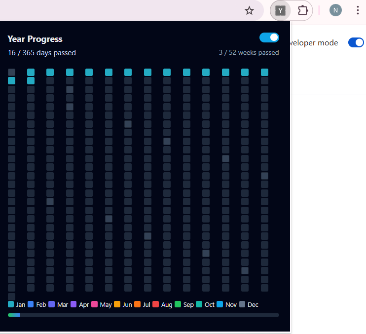

# 📅 Year Progress Grid – Chrome Extension

A lightweight Chrome extension that visualizes your entire year as a **color-coded grid**.

Each square represents **one day of the year**:
- ✅ Filled cells → days already passed  
- ⬜ Empty cells → days remaining  

The goal of this extension is to make time **visible at a glance** and help with reflection, planning, and motivation.

📸 **Screenshot**  
__

---

## ✨ Features

- Full-year grid (365 / 366 days)
- Automatic **leap year support**
- Month-wise color coding
- Clear month separators
- Hover tooltip showing exact date
- Day progress (e.g. `120 / 365 days passed`)
- Week progress (e.g. `18 / 52 weeks passed`)
- Visual progress bar
- Manual **Dark Mode toggle**
- Keyboard shortcut: press **D** to toggle dark mode
- No backend, no network calls
- No tracking, no data collection

---

## 🛠️ Tech Stack

- HTML
- CSS
- Vanilla JavaScript
- Chrome Extension (Manifest v3)

---

## 📂 Project Structure

year-progress-extension/
│
├── manifest.json # Chrome extension configuration
├── popup.html # Extension UI
├── popup.js # Logic (dates, grid, tooltip, dark mode)
├── style.css # Styling and themes
└── README.md # Documentation


---

## 🚀 How to Run This Extension Locally

You **do not need to publish** this extension to use it.

Follow these steps carefully:

---

### 1️⃣ Clone the repository

```bash
git clone https://github.com/your-username/year-progress-extension.git
```

### 2️⃣ Open Google Chrome

This extension works in Google Chrome.

### 3️⃣ Open the Extensions page

Paste this into the Chrome address bar and press Enter:

```
chrome://extensions
```

### 4️⃣ Enable Developer Mode

In the top-right corner, turn ON **Developer mode**.

### 5️⃣ Load the extension

Click **Load unpacked**.

Select the project folder (the folder that contains `manifest.json`).

Click **Select Folder**.

✅ The extension is now installed locally.

### 6️⃣ Open the extension

Click the 🧩 **Extensions** icon in the Chrome toolbar.

Pin **Year Progress Grid**.

Click the extension icon to open it

You should now see the full year grid 🎉

🎮 How to Use
🟩 Day Grid

Each square = one day

Colored squares = days already passed

Grey squares = upcoming days

🖱️ Tooltip

Hover over any square to see the exact date

📊 Progress Indicators

Days passed counter

Weeks passed counter

Visual progress bar

🌙 Dark Mode

Use the toggle in the header

Or press D on your keyboard

Theme preference is saved automatically

⌨️ Keyboard Shortcuts
Key	Action
D	Toggle Dark Mode

🔐 Privacy

This extension:

Does not collect any user data

Does not make any network requests

Does not use Chrome permissions

Everything runs locally in your browser.

🎨 Customization

You can easily customize:

Month colors

Grid size

Tooltip format

Dark mode styling

Week calculation logic

This project is intentionally simple and easy to modify.

🤝 Contribution

Feel free to fork this repository and improve it.
Pull requests and ideas are welcome.